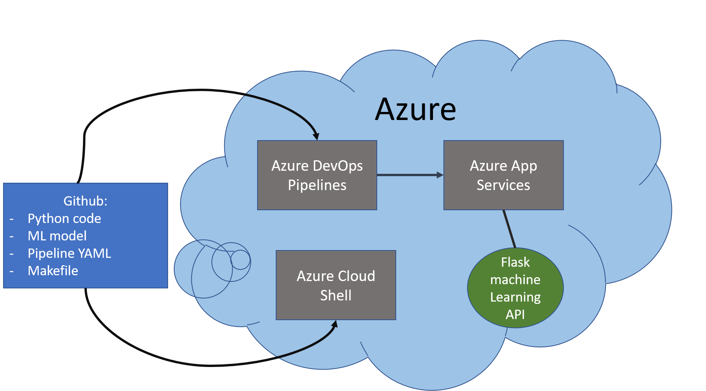
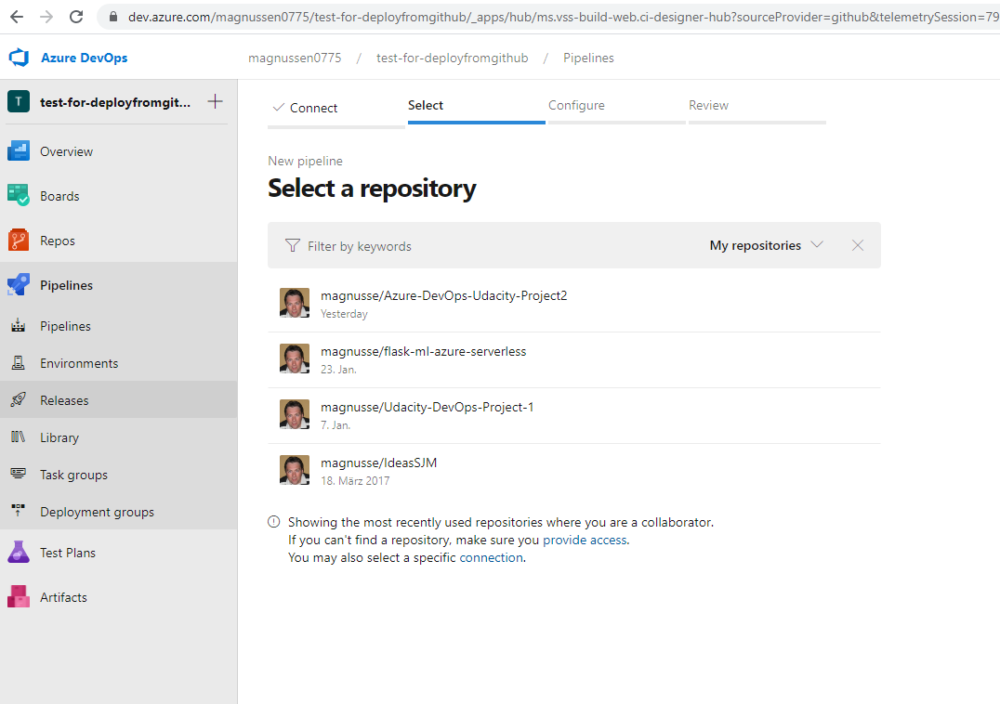

## Overview

This is a small Machine Learning App for Boston house price preiction based on a few parameters e.g. crime rate, distance to city centers etc. The app is implemented in python using scikit-learn and flask module. For running the application in the cloud azure web app Services is used. In this project you will find the code, the raw data for ML as well as the ML-model. Moreover we provide Makefile alonmg with Github actions and a YAML file to allow for CI/CD for further development and change in the code or input data.

## Project Plan
The project plan comprises a general plan (see excel file) and a more detailed plan as a kanban board in Trello.  The Trello Board is used for daily stand-ups and adjust planning on daily basis.

* The kanban Board https://trello.com/b/dzUvDvFY/udacity-dev-ops-proj2


&nbsp;

* The Project plan in Excel: https://github.com/magnusse/Azure-DevOps-Udacity-Project2/blob/main/Deliverables/ProjectPlan.xlsx


## Instructions
This is an explanation of the general setup of the python app using sklearn and Flask. The architecture looks as follows:


The python code along with the ML model, a Makefile and the Azure Pipeline configuration YAML-File you will find in the Github repository. The whole project can either be deployed as an Azure App Service using a CD pipeline in Azure DevOps or locally using your local machine or Azure Cloud Shell. Inn case of Azure App Service deployment the Machine Learning API (implemented in Python flask) is provided in the internet with a public IP address or the URL https://flaskmlservice.azurewebsites.net on port 443. In the latter case of local Test the Github repository is cloned to an Azure Cloud shell (or local bash) and the App is started with python. In that case the API can be used by "localhost" on port 5000.

In detail follow these steps get the App running on Azure App Services:

<TODO:  Instructions for running the Python project.  How could a user with no context run this project without asking you for any help.  Include screenshots with explicit steps to create that work. Be sure to at least include the following screenshots:

* Project running on Azure App Service, please also read the official documentation of Microsoft https://docs.microsoft.com/en-us/azure/devops/pipelines/ecosystems/python-webapp?view=azure-devops

  1. Open a Cloud shell in Azure and clone or pull (if already cloned with earlier version) the repository https://github.com/magnusse/Azure-DevOps-Udacity-Project2.git
&nbsp;
  
&nbsp;
&nbsp;

  2. Generate a webapp using Azure Cloud shell:
  ```bash
  udacity@Azure:~$ az webapp up -n flaskmlservice
  ```
  This will implement a template for an App which will be filled by the Azure Devops CD pipeline. Note: if you choose another name than _flaskmlservice_ you have to adapt this in the YAML file for Azure DevOps pipelines as well as in the .sh file for testing the application.

  3. Go to Azure DevOps https://azure.microsoft.com/de-de/services/devops/start and create a new project, choose connection with Github (not Github enterprise) and connect with the repository https://github.com/magnusse/Azure-DevOps-Udacity-Project2.git .
    

    you will then see the YAML file:
  

  4. Now run the pipeline manually and you will see after a while, that the software is successfully deployed to Azure App Services. In case of any errors click on the corresponding red step and read carefully error output.
    


  5. Have a look at the Output of streamed log files from deployed application
    

  6. Now if the app is up and running on Azure we can test the application by using the shell script "make_predict_azure_app.sh" which is also part of the repository. Go to the Azure cloud shell and look whether it has already executable mode:

    ```bash
    magnussen@Azure:~/Azure-DevOps-Udacity-Project2$ ls -al make_predict_azure_app.sh
    -rwxr--r-- 1 magnussen magnussen 445 Jan 26 17:49 make_predict_azure_app.sh
    magnussen@Azure:~/Azure-DevOps-Udacity-Project2$
    ```
    if not change this via ```  chmod 744  make_predict_azure_app.sh```
    You can now run ```  ./make_predict_azure_app.sh``` and read the output. The output should look similar to this:

    ```bash
    udacity@Azure:~$ ./make_predict_azure_app.sh
    Port: 443
    {"prediction":[20.35373177134412]}
    ```
    


* Running a test on Azure Cloud shell with local localhost. In the case we just start the app locally on either Azure cloud shell or on your local computer.
  1. First clone or pull the repository as above in the case of Azure app service.

  2. change to directory of the repository and start ```make all ```. This will install all required libraries and tools and checks the code by lint. The result should look like this:

    

  3. start the application by  ```python app.py   ```.  Be sure that you have started ```make all ``` before. After starting the application you should see:

    

  4. Now start a second shel (because the other is blocked by the app), change directory to the repository and run the shellscript ```make_prediction.sh   ```. As above in step 5 use ```chmod 744 make_orediction.sh ``` to allow execution of shell script. After starting the shellscript you should see:

    


## Enhancements

The following enhancements would improve the Project
  * adding more input variables for the ML model
  * provide a user interface to test the app online via web UI
  * Include more testcases testing the reliability of the model
  * Include options in the CI/CD pipeline to deploy app on a Docker container


## Demo

<TODO: Add link Screencast on YouTube>
